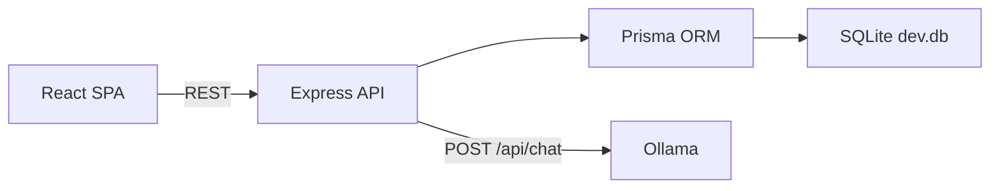

# Local AI Technical Roadmap Generator

Production-quality MVP that turns a short project brief into a structured technical roadmap using **only your local Ollama model**. No cloud AI providers and **no API keys**.

## Features

- Guided capture of project idea, platform, difficulty, priorities, and timeline
- Calls **Ollama `/api/chat`** with **structured JSON Schema** output (`stream: false`, low temperature)
- **Zod validation** on the server with **one repair retry** for bad JSON and one regeneration retry for schema violations
- Persists projects and analyses in **SQLite** via **Prisma**
- Responsive **React + Vite + Tailwind** dashboard with history, detail view, and exports
- Download roadmap as **JSON**, **Markdown**, **AGENTS.md** or **Technical TXT** report
- **Prompt Studio:** Generates optimized Master Prompts for Coding Agents (Cursor, Aider, Windsurf, etc.)

## Tech Stack

| Layer    | Technologies                                      |
| -------- | ------------------------------------------------- |
| Frontend | React 18, TypeScript, Vite, React Router, Axios, Tailwind CSS |
| Backend  | Node.js, Express, TypeScript, Prisma, SQLite, Zod |
| AI       | Ollama (local HTTP API)                           |

## Architecture Overview



1. Client submits `POST /api/projects/analyze`.
2. Server creates a `Project` row (`status = analyzing`).
3. Server prompts Ollama with system instructions + user payload and requests JSON matching the roadmap schema.
4. Server parses JSON, validates with Zod, retries once if needed.
5. Server writes `Analysis`, sets `status = completed`, returns JSON to the client.

## Folder Structure

```
/
  package.json
  README.md
  .gitignore
  /server
    package.json
    tsconfig.json
    .env.example
    /prisma
      schema.prisma
    /src
      index.ts
      /config
      /routes
      /controllers
      /services
      /schemas
      /utils
  /client
    package.json
    tsconfig.json
    vite.config.ts
    index.html
    .env.example
    /src
      main.tsx
      App.tsx
      /types
      /services
      /pages
      /components
      /styles
```

## Prerequisites

- **Node.js** 18+ (tested with Node 22)
- **npm**
- **Ollama** installed locally and running

## Ollama Setup

1. Install Ollama from [https://ollama.com](https://ollama.com).
2. Pull the recommended model:

```bash
ollama pull qwen2.5-coder:1.5b
```

3. Ensure the daemon is running (macOS menu bar app or `ollama serve`).

## Backend Setup

```bash
cd server
npm install
cp .env.example .env
npx prisma generate
npx prisma migrate dev --name init
npm run dev
```

The API listens on `http://localhost:3001` by default.

## Frontend Setup

```bash
cd client
npm install
cp .env.example .env.local   # optional — defaults to http://localhost:3001
npm run dev
```

The UI runs at `http://localhost:5173` by default.

## Root-Level Scripts

From the repository root:

```bash
npm run install:all   # install root + server + client deps
npm run dev           # run API + UI together (concurrently)
npm run dev:server
npm run dev:client
npm run build         # build server then client
npm run build:server
npm run build:client
```

## Example Project Idea

**Title:** Local-first personal finance dashboard  
**Description:** A privacy-focused web app where users connect read-only bank CSV exports, categorize transactions with rules, forecast cash flow for 90 days, and export monthly PDF summaries. Needs offline-friendly UX and multi-currency support.  
**Platform:** Web · **Difficulty:** Intermediate · **Priority:** Maintainability · **Weeks:** 10  

## Example Output Sections

After analysis you should see structured sections such as:

1. Project summary & problem framing  
2. Complexity score (0–10), estimated weeks, skill level, challenges  
3. Target user personas  
4. MVP scope bullets  
5. Prioritized core features  
6. Recommended stack (frontend/backend/database/AI/deployment/testing)  
7. Alternative stacks  
8. System modules (inputs/outputs)  
9. Database tables & columns  
10. REST endpoint sketch  
11. Week-by-week roadmap aligned to duration  
12. Risks & mitigations  
13. Future improvements  
14. **Coding Agent Prompt:** Optimized instructions for Cursor, Aider, etc.

## Troubleshooting

### Ollama not running

**Symptom:** UI shows *“Ollama is not running…”* or HTTP 503 from API.

**Fix:** Start Ollama and verify:

```bash
curl http://localhost:11434/api/tags
```

### Model not installed

**Symptom:** *“The selected Ollama model is not installed. Run: ollama pull MODEL_NAME”*

**Fix:**

```bash
ollama pull qwen2.5-coder:1.5b
# or change OLLAMA_MODEL in server/.env to a model you already pulled
```

### Invalid JSON response

**Symptom:** *“Ollama returned an invalid structured response…”*

**Fix:**

- Try a larger / stronger model (e.g., Qwen or Llama families suited for JSON).
- Retry the analysis; the server already performs one automatic repair pass.

### Database migration issues

**Symptom:** Prisma errors about missing tables.

**Fix:**

```bash
cd server
npx prisma migrate dev
```

Delete `server/prisma/dev.db` only if you accept losing local data, then rerun migrate.

### CORS issues

The API enables permissive CORS for local development. If you host the UI on another origin/port, update `cors({ origin: ... })` in `server/src/index.ts`.

## Known Limitations

- Quality depends entirely on the **local model** and hardware; smaller models may still break schema despite retries.
- SQLite is single-file and not suited for high concurrency production workloads without migration.
- Structured output requires Ollama builds that honor the `format` JSON Schema field; very old Ollama versions may behave differently.

## Future Improvements

- Authentication and multi-user workspaces
- Streaming responses with progressive UI updates
- Versioned analyses per project
- Prompt templates per domain (healthcare, fintech, etc.)
- Integration tests with a mocked Ollama server

## API Quick Reference

| Method | Path | Description |
| ------ | ---- | ----------- |
| GET | `/api/health` | Liveness + Ollama config echo |
| POST | `/api/projects/analyze` | Create project + run Ollama analysis |
| GET | `/api/projects` | List projects with summary |
| GET | `/api/projects/:id` | Project + full analysis |
| DELETE | `/api/projects/:id` | Delete project + analysis |
| GET | `/api/projects/:id/export/json` | Download JSON export |
| GET | `/api/projects/:id/export/markdown` | Download Markdown report |
| GET | `/api/projects/:id/export/txt` | Download Master Prompt TXT |
| GET | `/api/projects/:id/export/agents-md` | Download AGENTS.md |
| GET | `/api/projects/:id/export/prompt/:agent` | Download specific Agent prompt |

---

Adapt and extend as needed for your team or product.
